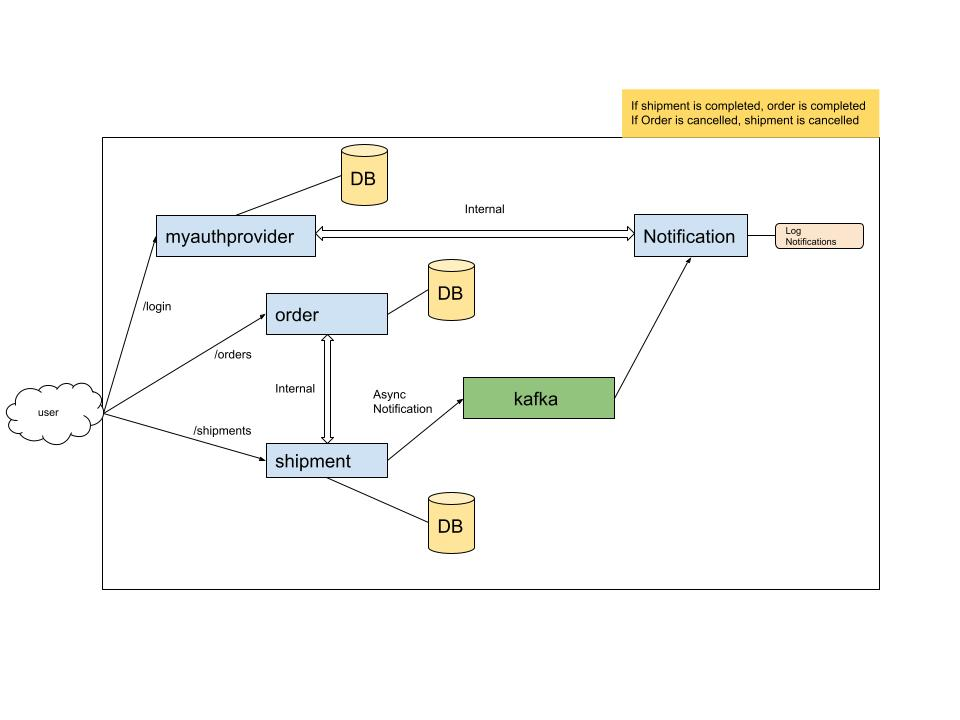

# my-sample-microservices

This is a sample microservices project. The pre-generated users can generate jwt tokens from the 'myauthprovider' microservice. They can then use the token to CRUD orders/shipments. The 'order' and 'shipment' microservices also communicate with each other for updating respective statuses. The 'shipment' microservice pushes respective notifications to a kafka topic from which the 'notification' microservice consumes data and can later send notifications by respective channel. As of now, the 'notification' microservice fetches user details from the 'myauthprovider' microservice and simply logs the notifications.

P.S: The order and shipment MS also use state machines for respective state transitions.

Instructions:

1. Clone Repo
2. docker-compose up - Spins up the postgres and the kafka container with the topic name 'notificationTopic'.
3. Run the microservices. (CommandLineRunner used in 'myauthprovider' microservice to insert some dummy users)
 
This is the architectural diagram of the project:

